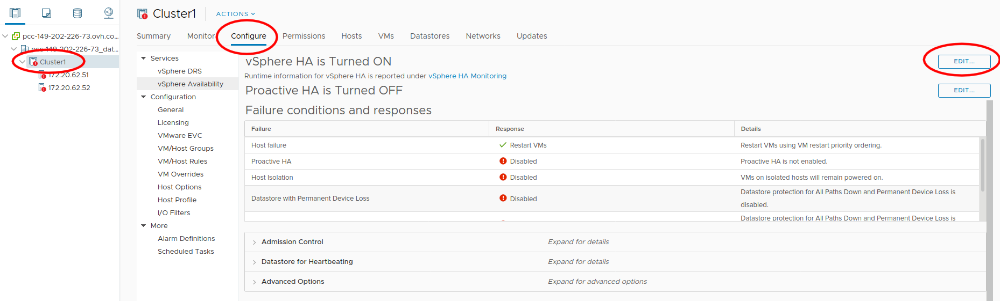
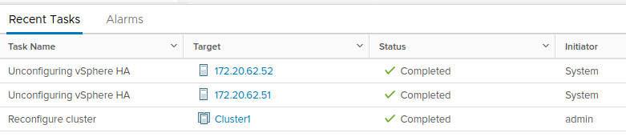
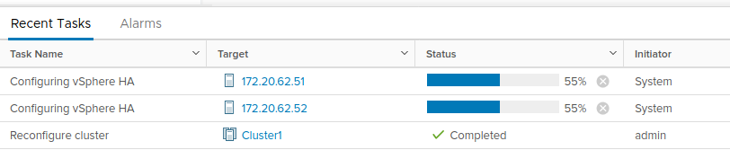

Connecting to a PCC
===================

The goal of this first part is to connect to your Private Cloud plateform and discover the very basics.

We will use some OVHCloud documentation.

Connect to your instance
------------------------

Just follow the steps discribed here :

https://docs.ovh.com/fr/private-cloud/connexion-interface-vsphere/

.. note::

        - You might prefer to use the HTML5 interface to prevent any Flash concern.
        - You may have a slightly different interface depending of the version of your PCC.

Checking VMware High-Availability
---------------------------------

Your PCC may show you some warnings regarding High-Availability.

.. image:: images/broken_ha.png

In this case, you need to configure it properly.

Go to the High-Availability control panel :

Deactivate it completely (switch it to **off**), and validate with **OK**.

.. image:: images/ha_config_panel_off.png

You should see some unconfiguring tasks in the bottom panel.

When these tasks are done, go back to the High-Availability control panel, switch it to **on** and validate with **OK** :

.. image:: images/ha_config_panel_on.png

You should see some configuring tasks in the bottom panel.

You can also refer to the following link if required : https://docs.ovh.com/fr/private-cloud/vmware-ha-high-availability/

Once this is done, proceed to the :doc:`next course <02_creating_template>`.
