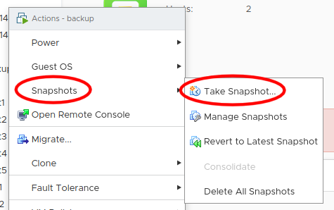

Creating a template
===================

Now that you are connected to your PCC, we will create a template for our next workshops.

Import the Ubuntu 18.04 template
--------------------------------

Every Private Cloud is provided with some templates (Windows and Linux). For our next workshops regarding Ansible and Terraform, we will need a Ubuntu 18.04.

You can refer to the following link to proceed : https://docs.ovh.com/fr/private-cloud/deploiement-template-ovh/

*Notes :*

- Please be careful when choosing a datastore for your VM : do not use any "storageLocalXXX" datastore, otherwise your VM could be lost in case of a host failure.

- Please also be careful regarding the network configuration : you **MUST** select the **VM Network** network to use your RIPE block.

Configure your template
------------------------

toto

Snapshot and poweroff your template
-----------------------------------

When your template is ready (you can connect to it with SSH, on your specific SSH port, and it is reboot-proof), you can power it off for now (typing *poweroff* in its shell or from the VMware console) :

.. image:: images/poweroff.png

When it is powered off, right-clic on it and create a snaphost (in case you need it).

Once this is done, you can go back to the main menu and start the Public Cloud workshop.
