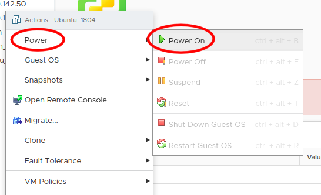
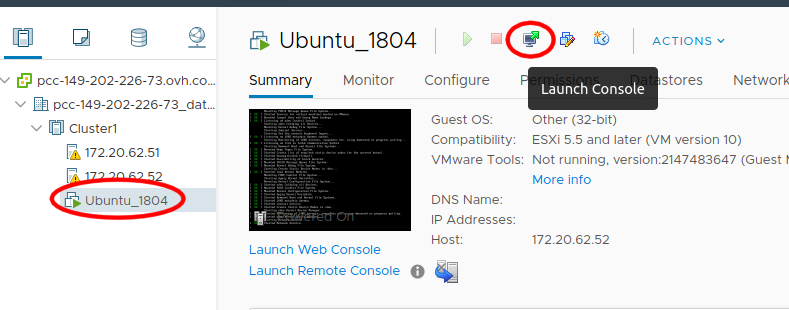
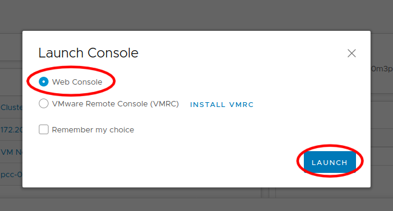
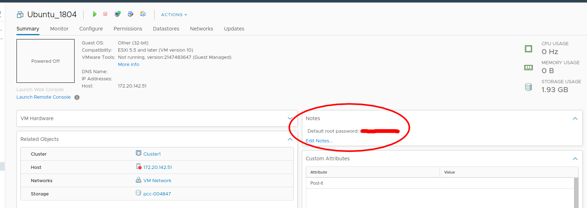
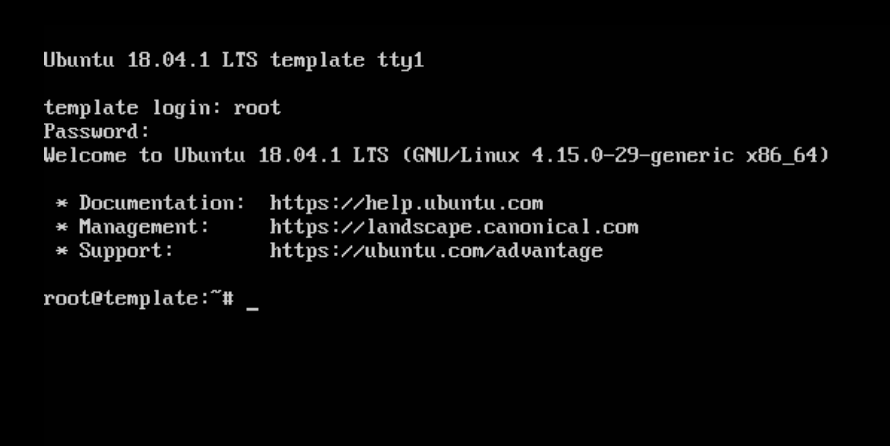
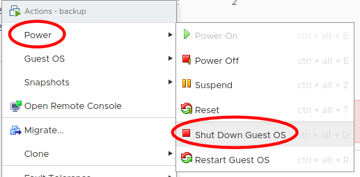
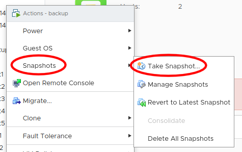

Creating a template
===================

Now that you are connected to your PCC, we will create a template for our next workshops.

Import the Ubuntu 18.04 template
--------------------------------

Every Private Cloud is provided with some templates (Windows and Linux). For our next workshops regarding Ansible and Terraform, we will need a **Ubuntu 18.04**.

You can refer to the following link to proceed : https://docs.ovh.com/fr/private-cloud/deploiement-template-ovh/

.. note::

        - Please be careful when choosing a datastore for your VM : do not use any "storageLocalXXX" datastore, otherwise your VM could be lost in case of a host failure.
        - Please also be careful regarding the network configuration : you **MUST** select the **VM Network** network to use your RIPE block.

Configure your template
------------------------

Once your Ubuntu 18.04 template is deployed, we will customize it a little. That way, we will only have to change the IP of each clone to have fresh new machines.

First connection with the web console
^^^^^^^^^^^^^^^^^^^^^^^^^^^^^^^^^^^^^

First, boot your VM.

Be careful to open the web console, to avoid having to install any extra component on your machine.

On the webconsole, you can connect with the root user and the password provided in the *Notes* field on your vSphere Client :

Set an IP and remote connect to your VM
^^^^^^^^^^^^^^^^^^^^^^^^^^^^^^^^^^^^^^^

To avoid as much problem as possible regarding the keyboard mapping to the console, we will just configure a temporary IP to your machine and pursue with a SSH terminal.

Your PCC is provided with a /28 RIPE block (as it is based in Europe) : the gateway is the last available IP of the block. Let's configure the first one on your VM :

.. code:: shell

    ~# ip addr add 145.239.217.1/28 dev eth0
    ~# ip route add default via 145.239.21.17

.. note::

        - In this example, we use a 145.239.217.0/28 block : adapt these values to your own block.
        - The default interface of your template should be *eth0* ; if not, please use the right interface name.

You should now be able to ping external machines :

.. image:: images/ping.png

Now, *from your workshop dedicated environnement*, connect to your template :

.. code:: shell

    ~# ssh root@145.239.217.1

Next step : make your IP configuration persistent.

Make IP configuration persistent
^^^^^^^^^^^^^^^^^^^^^^^^^^^^^^^^

Ubuntu environnements now use *netplan* to manage IP configuration.

.. code:: shell

    ~# vim /etc/netplan/01-netcfg.yaml

Change the *eth0* configuration according to your own needs :

.. code:: yaml

        # This file describes the network interfaces available on your system
        # For more information, see netplan(5).
        network:
          version: 2
          renderer: networkd
          ethernets:
            ens3:
              dhcp4: yes
        # This file describes the network interfaces available on your system
        # For more information, see netplan(5).
        network:
          version: 2
          renderer: networkd
          ethernets:
            eth0:
              dhcp4: no
              addresses: [145.239.217.1/28]
              gateway4: 145.239.217.14
              nameservers:
                addresses: [212.186.33.99]

.. note::

        Please note that this file is written in YAML, so be very careful to any space or tab character.

Check and apply your configuration :

.. code:: shell

    ~# netplan apply

Change root password
^^^^^^^^^^^^^^^^^^^^

Again, to limit problems (we will deactivate root login later with Ansible, but in the meantime it's safer), we can change the root password :

.. code:: shell

    ~# passwd
    ~# Enter new UNIX password: 
    ~# Retype new UNIX password: 
    ~# passwd: password updated successfully

.. note::

        - Please use a strong password, and note it carefully.
        - Keeping your first SSH connection open, try to open a new one to test your new password.

Validate your template configuration
^^^^^^^^^^^^^^^^^^^^^^^^^^^^^^^^^^^^

.. admonition:: Check your template is reboot-proof

        When your SSH and IP configurations are correct, reboot your machine. After reboot, we must be able to connect again with SSH and your new root password.

Snapshot and poweroff your template
-----------------------------------

When your template is ready (you can connect to it with SSH and it is reboot-proof), you can power it off for now (typing *poweroff* in its shell or from the VMware console) :

When it is powered off, right-clic on it and create a snaphost (in case you need it).

Once this is done, you can go back to the main menu and start the Public Cloud workshop.
