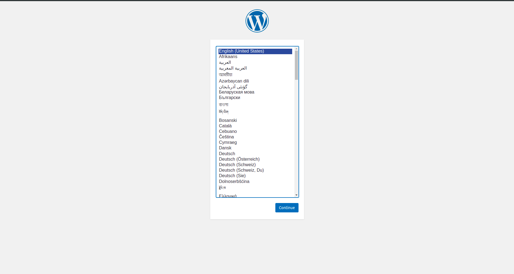
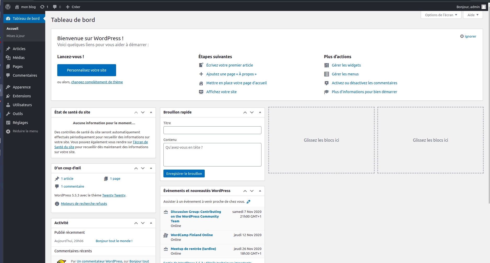

Deploy a simple application with Ansible
========================================

Retrieve your Ansible base repository
-------------------------------------

You won't start from scratch, let's clone a basic structure :

.. code:: shell
        
        $ git clone https://XXXXX.git
        $ cd ansible

Build your inventory
--------------------

First step to work with Ansible is to define your inventory.

.. note::

        As we won't use any DNS service or SSH user configuration for this workshop, we will provide some information directly into the Ansible inventory, such as your machines IPs and the user to connect to.

.. code:: shell

        $ vim inventory/hosts

For this first part, we will work with two machines : *db1* and *web1*.

A first basic attempt would be :

.. code:: ini

        [project1]
        db1 ansible_host=XX.XX.XX.XX ansible_user=XXXXX
        web1 ansible_host=XX.XX.XX.XX ansible_user=XXXXX

As you can see, we define in the inventory the IP of each machine and the user to connect to. But, the more the machines, the more duplicated information. Let's factorize a little :

.. code:: ini

        [project1]
        db1 ansible_host=XX.XX.XX.XX
        web1 ansible_host=XX.XX.XX.XX

        [project1:vars]
        ansible_user=XXXXX

Here, every machine from the *project1* group will inherit the *ansible_user* variable.

Finally, our machines will have different roles in our infrastructure, so it would be better to split them in more specific groups :

.. code:: ini

        [database_server]
        db1 ansible_host=XX.XX.XX.XX

        [web_server]
        web1 ansible_host=XX.XX.XX.XX

        [project1:children]
        database_server
        web_server

        [project1:vars]
        ansible_user=XXXXX

When you will execute a playbook against this inventory, it will compute every groups and variables dynamically : that way, you machine *db1*, as part of group *database_server*, is also part of the group *project1*, and then will benefit from the *project1* specific variables.
Adding a new machine in the *database_server* group will make it also benefit from the same variables.

.. note::

        As you can see, it is easy to build an inventory with Ansible, but it can also become a real puzzle if you have dozens or thousands of machines, splitted in many groups or sub-groups. Building a valid inventory can be difficult, and managing it on a day-to-day basis can lead to mistakes : you will quickly need some automation to build it from a CMDB.

Now we have our inventory, it's time to test it !

To do so, we will use the *ping* Ansible module, which will try to connect to your machines using the inventory information, and detect if a valid Python environnement is present. In our case, we specify we want to test it against the group *project1* :

.. code:: shell

        $ ansible -m ping project1

If you need to override the user to connect to, you need to use the *-u* parameter ; if you also need to specify a password, you need to use the *-k* parameter (password will be prompted dynamically).

.. code:: shell

        $ ansible -m ping project1 -u root -k
        SSH password:

You should have a result like this :

.. code:: shell

        web1 | SUCCESS => {
            "ansible_facts": {
                "discovered_interpreter_python": "/usr/bin/python3"
            },
            "changed": false,
            "ping": "pong"
        }
        db1 | SUCCESS => {
            "ansible_facts": {
                "discovered_interpreter_python": "/usr/bin/python"
            },
            "changed": false,
            "ping": "pong"
        }

Enforce your basic configuration
--------------------------------

Before doing anything else, we will run a basic playbook to ensure our SSH or hostname configuration is valid.

.. code:: shell

        $ vim playbooks/base.yml

.. code:: yaml

        - hosts:
          - all

          become: yes

          roles:
            - admins
            - ssh
            - hostname

As you can see, this playbook will run against all your machines, and use the *admins*, *ssh* and *hostname* roles. You should have a look to them to understand what they do, as **there is a missing part to make them work**.

.. note::

        When running playbooks, we may want to use some useful extra parameters :

        - *-C* (*check*) : many modules handle a dry run mode (not all of them)
        - *-D* (*diff*) : show any differences introduced by your playbook (can be used with *-C*)

Admin and SSH key configuration
^^^^^^^^^^^^^^^^^^^^^^^^^^^^^^^

The missing part is related to the *admins* role :

.. code:: shell

        $ vim roles/admins/tasks/main.yml

.. code:: yaml

        [...]

        - name: create unix groups for admin users
          group:
            name: "{{ item.username }}"
          with_items: "{{ admins }}"
          loop_control:
              label: "{{ item.username }}"

        [...]

In this small extract, you can see that this step is looking for a *admins* variable (as well as other steps), but this variable is neither defined in the role nor in a *defaults/main.yml* file. This variable is defined in the *group_vars* folder.

.. code:: shell

        $ vim inventory/group_vars/all/admins

.. code:: yaml

        ---

        admins:

        old_admins:
          - username: toto
            ssh_key: "ssh-ed25519 AAAAC3NzaC1lZDI1NTE5AAAAIN6z7BUPAKbv2R9NvrfmQN8m/8VVvXXl8sc0L73PYYXi toto@toto-computer"

.. admonition:: Admin username and SSH key configuration

        The *admins* variable is empty : based on the *old_admins* exemple, complete the missing part to create a **student** admin user with **your SSH key**.

Let's run !
^^^^^^^^^^^

When it's done, let's run our playbook (remember to use *-u* and/or *-k* parameters if required) :

.. code:: shell

        $ ansible-playbook playbooks/base.yml -D

        PLAY [project1] *******************************************************************************************

        TASK [Gathering Facts] *******************************************************************************
        ok: [web1]
        ok: [db1]

        TASK [admins : Set specific variables for distributions] *********************************************
        ok: [db1] => (item=~/ansible/roles/admins/vars/default.yml)
        ok: [web1] => (item=~/ansible/roles/admins/vars/default.yml)

        TASK [admins : install sudo] *************************************************************************
        ok: [web1]
        ok: [db1]

        TASK [admins : create unix groups for admin users] ***************************************************
        changed: [db1] => (item=Student)
        changed: [web1] => (item=Student)

        TASK [admins : create unix admin users] **************************************************************
        changed: [db1] => (item=Student)
        changed: [web1] => (item=Student)

        TASK [admins : set unix admin users authorized_keys] *************************************************
        --- before: /home/student/.ssh/authorized_keys
        +++ after: /home/student/.ssh/authorized_keys
        @@ -0,0 +1 @@
        +<mySshKey> Student

        changed: [web1] => (item=Student)
        --- before: /home/student/.ssh/authorized_keys
        +++ after: /home/student/.ssh/authorized_keys
        @@ -0,0 +1 @@
        +<mySshKey> Student

        changed: [db1] => (item=Student)

        TASK [configure sudoers file for admins] *************************************************************
        --- before: /etc/sudoers (content)
        +++ after: /etc/sudoers (content)
        @@ -28,3 +28,4 @@
         # See sudoers(5) for more information on "#include" directives:

         #includedir /etc/sudoers.d
        +student ALL = (ALL) NOPASSWD:ALL

        changed: [db1] => (item=Student)
        --- before: /etc/sudoers (content)
        +++ after: /etc/sudoers (content)
        @@ -28,3 +28,4 @@
         # See sudoers(5) for more information on "#include" directives:

         #includedir /etc/sudoers.d
        +student ALL = (ALL) NOPASSWD:ALL

        changed: [web1] => (item=Student)

        TASK [admins : remove old unix admin users authorized_keys (root)] ***********************************
        ok: [db1] => (item=Toto)
        ok: [web1] => (item=Toto)

        TASK [delete unix users for old admins] **************************************************************
        ok: [web1] => (item=Toto)
        ok: [db1] => (item=Toto)

        TASK [delete unix groups for old admins] *************************************************************
        ok: [web1] => (item=Toto)
        ok: [db1] => (item=Toto)

        TASK [remove old admins from sudoers file] ***********************************************************
        ok: [db1] => (item=Toto)
        ok: [web1] => (item=Toto)

        TASK [create root .ssh directory] ********************************************************************
        --- before
        +++ after
        @@ -1,5 +1,5 @@
         {
        -    "mode": "0755",
        +    "mode": "0750",
             "path": "/root/.ssh",
        -    "state": "absent"
        +    "state": "directory"
         }

        changed: [db1]
        --- before
        +++ after
        @@ -1,5 +1,5 @@
         {
        -    "mode": "0755",
        +    "mode": "0750",
             "path": "/root/.ssh",
        -    "state": "absent"
        +    "state": "directory"
         }

        changed: [web1]

        [...]

        RUNNING HANDLER [restart ssh] ************************************************************************
        changed: [web1]
        changed: [db1]

        PLAY RECAP *******************************************************************************************
        db1                        : ok=17   changed=3    unreachable=0    failed=0    skipped=1    rescued=0    ignored=0   
        web1                       : ok=17   changed=3    unreachable=0    failed=0    skipped=1    rescued=0    ignored=0 

As you can see, as some modification has been applied to the SSH configuration, Ansible applied the according handler and restarted the SSH daemon of each concerned machine. 

.. note::

        Starting from now, you won't be able to connect as *root* anymore. If required, remember to fix your *ansible_user* variable in your inventory to avoid having to specify it manually for each Ansible run.

Deploying our project
---------------------

Our goal for this project is to deploy a fresh Wordpress plateform. To achieve that, we need to identify our needs :

- a web server (we will use Apache)
- a database (we will use MySQL/MariaDB)
- a Wordpress installation

We could create a single playbook to manage all these steps, but we want our automation to be as generic and reusable as possible (if we have other projects requiring a web or database server).

So we will create 3 roles :

- *apache*, which will deploy a basic Apache2 + PHP7.2 instance
- *mysql-server*, which will deploy a fresh installation and secure it a little bit
- *wordpress*, which will deploy an instance of this CMS across our web and db machines

Deploying Apache
^^^^^^^^^^^^^^^^

First, we need a web server : Apache2.

This role will be very easy, as we only need to install 2 packages and enforce some PHP security rules.

We start by creating our role structure :

.. code:: shell

        $ mkdir -p roles/apache/{handlers,tasks}
        $ touch roles/apache/{handlers,tasks}/main.yml

Then, we create our 2 simple steps :

.. code:: shell

        $ vim roles/apache/tasks/main.yml

.. code:: yaml

        ---

        - name: Install apache2 and php7.2
          apt:
            name: '{{ item }}'
            state: 'present'
            update_cache: 'yes'
          with_items:
            - 'apache2'
            - 'libapache2-mod-php7.2'

        - name: Enforcing php security
          lineinfile:
            dest: "/etc/php/7.2/apache2/php.ini"
            regexp: "{{ item.regexp }}"
            line: "{{ item.line }}"
          notify: restart apache
          with_items:
            - regexp: "^#?expose_php"
              line: "expose_php = Off"
            - regexp: "^#?display_errors"
              line: "display_errors = Off"
            - regexp: "^#?display_startup_errors"
              line: "display_startup_errors = Off"
            - regexp: "^;?date.timezone"
              line: "date.timezone = Europe/Paris"

.. note::

        As you can see, here we use the *apt* module, as we only have Debian-based machines : we could also have used the *package* one, more generic.

When we enforce the PHP configuration, we need to reload the PHP engine if any modification is detected : that's why we need a *handler*.

.. code:: shell

        $ vim roles/apache/handlers/main.yml

.. code:: yaml

        ---

        - name: restart apache
          service: name=apache2 state=restarted

Finally, as our role cannot be run by itself, we need a playbook to launch it :

.. code:: shell

        $ vim playbooks/apache.yml

.. code:: yaml

        ---

        - hosts:
            - web_server

          become: yes

          roles:
            - apache

This playbook will run against all the machines in the *web_server* group and use the *apache* role.

You can run your playbook to check everything works :

.. code:: shell

        $ ansible-playbook playbooks/apache.yml -D

        PLAY [web_server] ************************************************************************************

        TASK [Gathering Facts] *******************************************************************************
        ok: [web1]

        TASK [Install apache2 and php7.2] ********************************************************************
        The following additional packages will be installed:
          apache2-bin apache2-data apache2-utils libapr1 libaprutil1
          libaprutil1-dbd-sqlite3 libaprutil1-ldap libasn1-8-heimdal libgdbm-compat4
          libgssapi3-heimdal libhcrypto4-heimdal libheimbase1-heimdal
          libheimntlm0-heimdal libhx509-5-heimdal libkrb5-26-heimdal libldap-2.4-2
          libldap-common liblua5.2-0 libnghttp2-14 libperl5.26 libroken18-heimdal
          libsasl2-2 libsasl2-modules libsasl2-modules-db libsodium23 libssl1.1
          libwind0-heimdal perl perl-base perl-modules-5.26 php-common php7.2-cli
          php7.2-common php7.2-json php7.2-opcache php7.2-readline ssl-cert
        Suggested packages:
          www-browser apache2-doc apache2-suexec-pristine | apache2-suexec-custom
          php-pear libsasl2-modules-gssapi-mit | libsasl2-modules-gssapi-heimdal
          libsasl2-modules-ldap libsasl2-modules-otp libsasl2-modules-sql perl-doc
          libterm-readline-gnu-perl | libterm-readline-perl-perl make
          openssl-blacklist
        The following NEW packages will be installed:
          apache2 apache2-bin apache2-data apache2-utils libapache2-mod-php7.2 libapr1
          libaprutil1 libaprutil1-dbd-sqlite3 libaprutil1-ldap libasn1-8-heimdal
          libgdbm-compat4 libgssapi3-heimdal libhcrypto4-heimdal libheimbase1-heimdal
          libheimntlm0-heimdal libhx509-5-heimdal libkrb5-26-heimdal libldap-2.4-2
          libldap-common liblua5.2-0 libnghttp2-14 libperl5.26 libroken18-heimdal
          libsasl2-2 libsasl2-modules libsasl2-modules-db libsodium23 libwind0-heimdal
          perl perl-modules-5.26 php-common php7.2-cli php7.2-common php7.2-json
          php7.2-opcache php7.2-readline ssl-cert
        The following packages will be upgraded:
          libssl1.1 perl-base
        2 upgraded, 37 newly installed, 0 to remove and 201 not upgraded.
        changed: [web1] => (item=[u'apache2', u'libapache2-mod-php7.2'])

        TASK [apache : Enforcing php security] ***************************************************************
        ok: [web1] => (item={u'regexp': u'^#?expose_php', u'line': u'expose_php = Off'})
        ok: [web1] => (item={u'regexp': u'^#?display_errors', u'line': u'display_errors = Off'})
        ok: [web1] => (item={u'regexp': u'^#?display_startup_errors', u'line': u'display_startup_errors = Off'})
        --- before: /etc/php/7.2/apache2/php.ini (content)
        +++ after: /etc/php/7.2/apache2/php.ini (content)
        @@ -933,7 +933,7 @@
         [Date]
         ; Defines the default timezone used by the date functions
         ; http://php.net/date.timezone
        -;date.timezone =
        +date.timezone = Europe/Paris
         
         ; http://php.net/date.default-latitude
         ;date.default_latitude = 31.7667

        changed: [web1] => (item={u'regexp': u'^;?date.timezone', u'line': u'date.timezone = Europe/Paris'})

        RUNNING HANDLER [restart apache] *********************************************************************
        changed: [web1]

        PLAY RECAP *******************************************************************************************
        web1                       : ok=4    changed=3    unreachable=0    failed=0    skipped=0    rescued=0    ignored=0

Deploying MySQL
^^^^^^^^^^^^^^^

This role will be more complicated ; let's incorporate it directly in our repository :

.. code:: shell

        $ cd /tmp
        $ wget https://XXXXXXX/mysql-server.tar.gz
        $ tar -xzf mysql-server.tar.gz
        $ mv mysql-server ~/ansible/roles/
        $ cd ~/ansible/roles/

In this role, we have 2 tasks :

- deploy and secure MySQL
- deploy a backup tool
  
To make things clear, we will split them in two separate files.

Server
~~~~~~

In the *server.yml* part, we need to install the required packages.

.. code:: shell

        $ vim roles/mysql-server/tasks/server.yml

.. admonition:: Install MySQL required packages

        Based on the *apache* example, complete the first step to deploy the following packages :

        - 'python-mysqldb'
        - 'python-pymysql'
        - 'python3-mysqldb'
        - 'python3-pymysql'
        - 'mariadb-server'

You will notice in the third step that we have a *notify* statement, because we could have some MySQL configuration changes.

.. code:: shell

        $ vim roles/mysql-server/handlers/main.yml

.. admonition:: Implement MySQL handler

        Based on the *apache* example, again, complete the *handlers/main.yml* file to manage the restart of the *mariadb* process when required.

Last but not least, you may notice that a *mysql_root_password* variable is required : we will put it in the *host_vars* inventory folder, as it is very specific of each database server.

.. code:: shell

        $ mkdir inventory/hosts_vars
        $ vim inventory/hosts_vars/db1

.. code:: yaml

        ---

        mysql_root_password: insecurerootpass

Backups
~~~~~~~

The other task is about the deployment of *automysqlbackup*, a small script which will handle dumps and their rotation in a dedicated folder.

If you look inside the *defaults* folder of the role, you will see some variables :

.. code:: yaml

        ---

        mysql_admin_mail: toto@example.fr
        mysql_backups_daily_retention: 3
        mysql_backups_directory: /var/backups/automysqlbackup

These variables will be used in the *automysqlserver* configuration template.

.. code:: shell

        $ vim roles/mysql-server/templates/automysqlbackup.conf.j2

.. admonition:: Integrate *automysqlserver* variables

        Based on the *templates/my.cnf.j2* example, complete the following variables calls of the *templates/automysqlbackup.conf.j2* template :

        - CONFIG_mysql_dump_password
        - CONFIG_backup_dir
        - CONFIG_rotation_daily
        - CONFIG_mail_address

MySQL playbook
~~~~~~~~~~~~~~

Last step, we need a playbook to call our role. First, let's check our role is calling both our *server* and *backups* sub-tasks :

.. code:: shell

        $ cat roles/mysql-server/tasks/main.yml

.. code:: yaml

        ---

        - include: server.yml

        - include: backups.yml

That looks good. Let's create the according playbook :

.. code:: shell

        $ vim playbooks/mysql.yml

.. code:: yaml

        ---

        - hosts:
            - database_server

          become: yes

          roles:
            - mysql

You can run your playbook to check everything works :

.. code:: shell

        $ ansible-playbook playbooks/mysql.yml -D

        PLAY [database_server] *******************************************************************************

        TASK [Gathering Facts] *******************************************************************************
        ok: [db1]

        TASK [mysql-server : Install packages] ***************************************************************
        The following additional packages will be installed:
          galera-3 gawk libaio1 libcgi-fast-perl libcgi-pm-perl
          libconfig-inifiles-perl libdbd-mysql-perl libdbi-perl libencode-locale-perl
          libfcgi-perl libgdbm-compat4 libhtml-parser-perl libhtml-tagset-perl
          libhtml-template-perl libhttp-date-perl libhttp-message-perl libio-html-perl
          libjemalloc1 liblwp-mediatypes-perl libmpfr6 libmysqlclient20 libperl5.26
          libpython-stdlib libpython2.7-minimal libpython2.7-stdlib libsigsegv2
          libssl1.1 libterm-readkey-perl libtimedate-perl liburi-perl
          mariadb-client-10.1 mariadb-client-core-10.1 mariadb-common
          mariadb-server-10.1 mariadb-server-core-10.1 mysql-common perl perl-base
          perl-modules-5.26 python python-minimal python2.7 python2.7-minimal socat
        Suggested packages:
          gawk-doc libclone-perl libmldbm-perl libnet-daemon-perl
          libsql-statement-perl libdata-dump-perl libipc-sharedcache-perl libwww-perl
          mailx mariadb-test tinyca perl-doc libterm-readline-gnu-perl
          | libterm-readline-perl-perl make python-doc python-tk
          python-egenix-mxdatetime python-mysqldb-dbg python-pymysql-doc python2.7-doc
          binutils binfmt-support python3-mysqldb-dbg
        The following NEW packages will be installed:
          galera-3 gawk libaio1 libcgi-fast-perl libcgi-pm-perl
          libconfig-inifiles-perl libdbd-mysql-perl libdbi-perl libencode-locale-perl
          libfcgi-perl libgdbm-compat4 libhtml-parser-perl libhtml-tagset-perl
          libhtml-template-perl libhttp-date-perl libhttp-message-perl libio-html-perl
          libjemalloc1 liblwp-mediatypes-perl libmpfr6 libmysqlclient20 libperl5.26
          libpython-stdlib libpython2.7-minimal libpython2.7-stdlib libsigsegv2
          libterm-readkey-perl libtimedate-perl liburi-perl mariadb-client-10.1
          mariadb-client-core-10.1 mariadb-common mariadb-server mariadb-server-10.1
          mariadb-server-core-10.1 mysql-common perl perl-modules-5.26 python
          python-minimal python-mysqldb python-pymysql python2.7 python2.7-minimal
          python3-mysqldb python3-pymysql socat
        The following packages will be upgraded:
          libssl1.1 perl-base
        2 upgraded, 47 newly installed, 0 to remove and 201 not upgraded.
        changed: [db1] => (item=[u'python-mysqldb', u'python-pymysql', u'python3-mysqldb', u'python3-pymysql', u'mariadb-server'])

        TASK [mysql-server : Start and enable the MySQL service] *********************************************
        ok: [db1]

        TASK [mysql-server : Change MySQL configuration] *****************************************************
        --- before: /etc/mysql/mariadb.conf.d/50-server.cnf (content)
        +++ after: /etc/mysql/mariadb.conf.d/50-server.cnf (content)
        @@ -26,7 +26,7 @@
         
         # Instead of skip-networking the default is now to listen only on
         # localhost which is more compatible and is not less secure.
        -bind-address		= 127.0.0.1
        +bind-address = 0.0.0.0
         
         #
         # * Fine Tuning

        changed: [db1]

        TASK [mysql-server : update mysql root password for all root accounts] *******************************
        changed: [db1] => (item=db1)
        changed: [db1] => (item=127.0.0.1)
        changed: [db1] => (item=::1)
        changed: [db1] => (item=localhost)

        TASK [mysql-server : Removes all anonymous user accounts] ********************************************
        ok: [db1]

        TASK [mysql-server : Removes the MySQL test database] ************************************************
        [WARNING]: Module did not set no_log for unsafe_login_password
        ok: [db1]

        TASK [mysql-server : copy .my.cnf file with root password credentials] *******************************
        --- before
        +++ after: /home/fhallerc/.ansible/tmp/ansible-local-20525fBRb0T/tmp30UMkV/my.cnf.j2
        @@ -0,0 +1,3 @@
        +[client]
        +user=root
        +password=insecurerootpass

        changed: [db1]

        TASK [mysql-server : Create automysqlbackup directories] *********************************************
        --- before
        +++ after
        @@ -1,5 +1,5 @@
         {
        -    "mode": "0755",
        +    "mode": "0750",
             "path": "/var/backups/automysqlbackup",
        -    "state": "absent"
        +    "state": "directory"
         }

        changed: [db1] => (item=/var/backups/automysqlbackup)
        --- before
        +++ after
        @@ -1,5 +1,5 @@
         {
        -    "mode": "0755",
        +    "mode": "0750",
             "path": "/etc/automysqlbackup",
        -    "state": "absent"
        +    "state": "directory"
         }

        changed: [db1] => (item=/etc/automysqlbackup)

        TASK [mysql-server : Copy automysqlbackup bin and cron] **********************************************
        --- before
        +++ after: /home/fhallerc/Documents/Projets/Cours Cloud EMA/ansible/tp2-2/roles/mysql-server/files/automysqlbackup/bin/automysqlbackup
        @@ -0,0 +1,2255 @@
        +#!/usr/bin/env bash

        [...]

        changed: [db1] => (item={u'dest': u'/etc/automysqlbackup/automysqlbackup.conf', u'src': u'automysqlbackup/etc/automysqlbackup.conf.j2', u'mode': u'600'})

        RUNNING HANDLER [mysql-server : restart mysql] *******************************************************
        changed: [db1]

        PLAY RECAP *******************************************************************************************
        db1                        : ok=12   changed=8    unreachable=0    failed=0    skipped=0    rescued=0    ignored=0

Deploying Wordpress
^^^^^^^^^^^^^^^^^^^

We have a web server, we have a database server : time to Wordpress !

The same way we imported a pre-made *mysql-server* role, we will copy a *wordpress* one :

.. code:: shell

        $ cd /tmp
        $ wget https://XXXXXXX/wordpress.tar.gz
        $ tar -xzf wordpress.tar.gz
        $ mv wordpress ~/ansible/roles/
        $ cd ~/ansible/roles/

Deploying a Wordpress is a 2-steps operation : a database, and the CMS itself. Again, to make things clear, we will split it in 2 subtasks.

Database part
~~~~~~~~~~~~~

The *tasks/db.yml* is already provided, but again we need some variables.

.. code:: shell

        $ vim roles/wordpress/defaults/main.yml

.. admonition:: Provide default Wordpress database variables

        We want the following variables to be defined :

        - a *mysql_wordpress_username* with the value *wordpress*
        - a *mysql_wordpress_database_name* with the value *wordpress*
        - a *mysql_wordpress_password* with the value *insecurewppass*

Web part
~~~~~~~~

If we look at *tasks/web.yml*, we can see that some parts are missing.

.. code:: shell

        $ vim roles/wordpress/tasks/web.yml

.. admonition:: Copy the Wordpress configuration template

        A *templates/wp-config.php.j2* file is provided. You need to copy it to your server, according to the following parameters :

        - destination directory is */var/www/wordpress*
        - you file must meet the *rw-------* access rights
        - and it must be owned by the user *www-data*

        We already used a module to do it earlier. You should have a look into your roles.

.. admonition:: Activate the *rewrite* module

        Your Wordpress need the Apache *rewrite* module to be activated. You need to look at the Ansible documatation available at https://docs.ansible.com/ to find the right module and syntax.

        **Do not forget that this step should ask for an Apache restart if something change !**

Puzzle time !
~~~~~~~~~~~~~

Now our 2 subtasks are ready, we need to glue them together :

.. code:: shell

        $ cat roles/wordpress/tasks/main.yml

.. code:: yaml

        ---

        - name: create wordpress database
          include: db.yml
          when: "'database_server' in group_names"

        - name: deploy wordpress CMS
          include: web.yml
          when: "'web_server' in group_names"

As you can see, this role will call the *db.yml* and *web.yml* subtasks on the right groups.

Do you remember the *wp-config.php* template we will deploy ? Well, if you look at it you will see that it requires a *wordpress_database* variable we didn't create anywhere ; the same way, if you carefully look the *roles/db.yml* subtask, you will see that a *wordpress_webserver* variable is also required.

These variables are the ones we will use to create a database only available for our webserver, and that we will provide to our Wordpress to tell it which database to use.

In this context, it could make sense to define them as *group_vars*, as they should not be the defaults variables for this role (to make it generic).

.. admonition:: Still more variables

        You need to provide the following variables as *group_vars* variables :

        - *wordpress_database* with the private IP of your database as value
        - *wordpress_webserver* with the private IP of your webserver as value

Finally, the ultimate puzzle : the deployment playbook.

First, we will create a simple *wordpress* playbook :

.. code:: shell

        $ vim playbooks/wordpress.yml

.. code:: yaml

        - hosts:
            - wordpress

          become: yes

          roles:
            - wordpress

Now, the last step : the playbook which will handle our others playbooks.

.. code:: shell

        $ vim playbooks/deploy-wordpress.yml

.. code:: yaml

        ---

        - include: mysql.yml

        - include: apache.yml

        - include: wordpress.yml

When you have completed all the previous steps and your *deploy-wordpress.yml* playbook is ready, have a breath (you deserve it).

Let's resume what will happen here :

- First, we call the *mysql.yml* playbook, which will deploy the *mysql-server* role agasint all the corresponding machines. As we already did it, it shouldn't change anything.
- Next, we call the *apache.yml*. Same thing.
- To finish, we call our new *wordpress.yml*, which will create the required database for our project, then copy the last available Wordpress version to our web server, configure Apache to serve it and our Wordpress to work with the right fresh new database.

.. note::

        The way we built our project, we can now periodically run our *apache.yml* and *mysql.yml* playbooks to ensure our database and web servers are fully deployed, and with the right configurations.

        We can also run our *deploy-wordpress.yml* as a one-time operation, and we will be sure that our CMS is deployed over an up-to-date and ready plateform.

Ok, that sounds good. Let's try !

.. code:: shell

        $ ansible-playbook playbooks/deploy-wordpress.yml -D

        PLAY [database_server] *******************************************************************************

        TASK [Gathering Facts] *******************************************************************************
        ok: [db1]

        TASK [mysql-server : Install packages] ***************************************************************
        ok: [db1] => (item=[u'python-mysqldb', u'python-pymysql', u'python3-mysqldb', u'python3-pymysql', u'mariadb-server'])

        TASK [mysql-server : Start and enable the MySQL service] *********************************************
        ok: [db1]

        TASK [mysql-server : Change MySQL configuration] *****************************************************
        ok: [db1]

        TASK [mysql-server : update mysql root password for all root accounts] *******************************
        ok: [db1] => (item=db1)
        ok: [db1] => (item=127.0.0.1)
        ok: [db1] => (item=::1)
        ok: [db1] => (item=localhost)

        TASK [mysql-server : Removes all anonymous user accounts] ********************************************
        ok: [db1]

        TASK [mysql-server : Removes the MySQL test database] ************************************************
        ok: [db1]

        TASK [mysql-server : copy .my.cnf file with root password credentials] *******************************
        ok: [db1]

        TASK [mysql-server : Create automysqlbackup directories] *********************************************
        ok: [db1] => (item=/var/backups/automysqlbackup)
        ok: [db1] => (item=/etc/automysqlbackup)

        TASK [mysql-server : Copy automysqlbackup bin and cron] **********************************************
        ok: [db1] => (item={u'dest': u'/usr/local/bin/automysqlbackup', u'src': u'automysqlbackup.bin', u'mode': u'700'})
        ok: [db1] => (item={u'dest': u'/etc/cron.d/automysqlbackup', u'src': u'automysqlbackup.cron', u'mode': u'644'})

        TASK [mysql-server : Copy automysqlbackup conf] ******************************************************
        ok: [db1] => (item={u'dest': u'/etc/automysqlbackup/automysqlbackup.conf', u'src': u'automysqlbackup.conf.j2', u'mode': u'600'})

        PLAY [web_server] ************************************************************************************

        TASK [Gathering Facts] *******************************************************************************
        ok: [web1]

        TASK [Install apache2 and php7.2] ********************************************************************
        ok: [web1] => (item=[u'apache2', u'libapache2-mod-php7.2'])

        TASK [apache : Enforcing php security] ***************************************************************
        ok: [web1] => (item={u'regexp': u'^#?expose_php', u'line': u'expose_php = Off'})
        ok: [web1] => (item={u'regexp': u'^#?display_errors', u'line': u'display_errors = Off'})
        ok: [web1] => (item={u'regexp': u'^#?display_startup_errors', u'line': u'display_startup_errors = Off'})
        ok: [web1] => (item={u'regexp': u'^;?date.timezone', u'line': u'date.timezone = Europe/Paris'})

        PLAY [wordpress] *************************************************************************************

        TASK [Gathering Facts] *******************************************************************************
        ok: [web1]
        ok: [db1]

        TASK [wordpress : Create Wordpress mysql database] ***************************************************
        skipping: [web1]
        ok: [db1]

        TASK [wordpress : Create Wordpress mysql user] *******************************************************
        skipping: [web1]
        ok: [db1]

        TASK [wordpress : Install apache2 and php7.2] ********************************************************
        skipping: [db1] => (item=[])
        ok: [web1] => (item=[u'mariadb-client', u'php7.2-cli', u'php7.2-common', u'php7.2-curl', u'php7.2-gd', u'php7.2-intl', u'php7.2-ldap', u'php7.2-mbstring', u'php7.2-mysql', u'php7.2-soap', u'php7.2-xml', u'php7.2-xmlrpc', u'php7.2-zip'])

        TASK [wordpress : Get and extract last Wordpress] ****************************************************
        skipping: [db1]
        ok: [web1]

        TASK [wordpress : Copy Wordpress wp-config file] *****************************************************
        skipping: [db1]
        ok: [web1]

        TASK [wordpress : Copy Wordpress apache conf files] **************************************************
        skipping: [db1] => (item={u'dest': u'/etc/apache2/sites-available/wordpress.conf', u'src': u'wordpress.conf', u'mode': u'644'})
        skipping: [db1] => (item={u'dest': u'/etc/apache2/.htaccess_wordpress', u'src': u'htaccess', u'mode': u'600'})
        ok: [web1] => (item={u'dest': u'/etc/apache2/sites-available/wordpress.conf', u'src': u'wordpress.conf', u'mode': u'644'})
        ok: [web1] => (item={u'dest': u'/etc/apache2/.htaccess_wordpress', u'src': u'htaccess', u'mode': u'600'})

        TASK [wordpress : Deactivate default apache conf file] ***********************************************
        skipping: [db1]
        ok: [web1]

        TASK [wordpress : Activate Wordpress apache conf file] ***********************************************
        skipping: [db1]
        ok: [web1]

        TASK [wordpress : Activate rewrite module] ***********************************************************
        skipping: [db1]
        ok: [web1]

        PLAY RECAP *******************************************************************************************
        db1                        : ok=14   changed=0    unreachable=0    failed=0    skipped=7    rescued=0    ignored=0
        web1                       : ok=11   changed=0    unreachable=0    failed=0    skipped=2    rescued=0    ignored=0

You can now visit your Wordpress ! Go to http://<your public webserver IP>.

.. note::

        As a little security (your Wordpress is not fully configured, and we didn't deploy any SSL configuration), you will be asked for some htaccess credentials : they are available into your *.openrc* file.

You should have the following screen :

Complete the installation process with some random values, and tadaaaaa :

When your Wordpress deployment is finished, you can go to the :doc:`next course <03_tf_add_backup_infra>`
