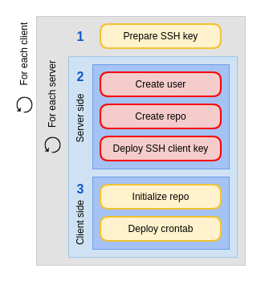

Deploy backup application with Ansible
======================================

Now that we have a new backup machine, we will deploy BorgBackup (https://borgbackup.readthedocs.io/en/stable/).

BorgBackup is just a small binary to push on your machines, and each of them can then act as a client or a server : it's just about repositories and SSH.

In our case, we will define our fresh new *backup* machine to host our repositories, and make our others nodes to push some backups to it every night.

.. note::

        As you may remember, we deployed an *automysqlbackup* mechanism on our *db1* node, to handle dumps everynight. The crontab we associated with it is set to 12PM, so it would make sense to define our backups right after them, let's say to 1:30AM, to also include the dump of the day.

Update your inventory
---------------------

First, we need to add our new server to our inventory :

.. code:: shell

        $ vim inventory/hosts

.. code:: ini

        backup ansible_host=<your IP>

.. admonition:: Task 1 : Secure your *backup* machine and update your */etc/hosts*

        Before doing anything else, you have to run your *base.yml* playbook against your machines, to ensure that :

        - your *backup* node is compiant with your security standards (SSH, etc...)
        - every machine of your infrastructure has valid */etc/hosts* entries to join it.

You need to have this kind of result :

.. code:: shell

        [...]

        TASK [hostname : Generate /etc/hosts from inventory] *************************************************

        [...]

        --- before: /etc/hosts (content)
        +++ after: /etc/hosts (content)
        @@ -7,3 +7,4 @@
         ff02::2 ip6-allrouters
         54.36.219.50 db1
         54.36.219.56 web1
        +54.36.219.49 backup

        changed: [web1] => (item=backup)
        --- before: /etc/hosts (content)
        +++ after: /etc/hosts (content)
        @@ -7,3 +7,4 @@
         ff02::2 ip6-allrouters
         54.36.219.50 db1
         54.36.219.56 web1
        +54.36.219.49 backup

        changed: [db1] => (item=backup)

        [...]

BorgBackup deployement
----------------------

Ok, now we can create a new role :

.. code:: shell

        $ mkdir -p roles/borgbackup/{tasks,defaults}
        $ vim roles/borgbackup/tasks/main.yml

.. code:: yaml

        ---

        - name: check if borgbackup already there
          stat: path=/usr/local/bin/borg-{{ borg_version }}
          register: stat_result

        - name: download borgbackup
          get_url:
            url: https://github.com/borgbackup/borg/releases/download/{{ borg_version }}/borg-linux64
            dest: /usr/local/bin/borg-{{ borg_version }}
            owner: root
            group: root
            mode: 0755
          when: stat_result.stat.exists == False 

        - name: link borgbackup executable
          file:
            src: /usr/local/bin/borg-{{ borg_version }}
            dest: /usr/local/bin/borg
            owner: root
            group: root
            state: link

.. code:: shell

        $ vim roles/borgbackup/defaults/main.yml

.. code:: yaml

        ---
        
        borg_version: 1.1.9

Two things to notice here :

- We define a *borg_version* variable to make our infrastructure easier to control : if we need to deploy a specific version for security or stability purpose, we can. You are now more familiar with Ansible variables, so you can also notice that we could override this variable using a *group_var* or a *host_var* if required (as long as the version on your servers and nodes are compatible).
- The first step of this role is to check if our specific Borg version is already present : to do this, we use the *stat* Ansible module and register a new variable *stat_result*, which is a dictionary. Inside this, we have a lot of values (*checksum*, *attributes*, *size*...) : in our case, we check that this file is present, so we use the *exists* boolean value.

Don't forget the according playbook :

.. code:: shell

        $ vim playbooks/borgbackup.yml

.. code:: yaml

        - hosts:
            - all

          become: yes

          roles:
            - borgbackup

And run it (in this example, we limit the playbook execution to our *backup* machine as our clients will be configured later) :

.. code:: shell

        $ ansible-playbook playbooks/borgbackup-server.yml -D --limit=backup

        PLAY [borgbackup_server] *****************************************************************************

        TASK [Gathering Facts] *******************************************************************************
        ok: [backup]

        TASK [borgbackup-server : check if borgbackup already there] *****************************************
        ok: [backup]

        TASK [borgbackup-server : download borgbackup] *******************************************************
        changed: [backup]

        TASK [borgbackup-server : link borgbackup executable] ************************************************
        --- before
        +++ after
        @@ -1,4 +1,4 @@
         {
             "path": "/usr/local/bin/borg",
        -    "state": "absent"
        +    "state": "link"
         }

        changed: [backup]

        PLAY RECAP *******************************************************************************************
        backup                     : ok=4    changed=2    unreachable=0    failed=0    skipped=0    rescued=0    ignored=0

.. admonition:: Task 2 : Additional check

        Ok, we copy a binary file to our machines to deploy Borg, but what if this file is damaged ?

        You need to check the checksum of the file you download.

BorgBackup clients
------------------

At this step, you may ask yourself where is the server configuration, where did we create our repositories ?

Be patient, young Padawans.

In a traditional **workflow**, the server is far less dynamic than the rest of our infrastructure : the backup deployment is more related to each new client node, so it makes more sense to handle it in a dedicated *borgbackup-client* role.

This role will have the following directives :

- prepare what is required on the client side (a SSH key, basically)
- create the related repository on the right server, deploy the client key and make some security configuration
- configure the crontab on the client

Again, here is the skeleton of our role :

.. code:: shell

        $ cd /tmp
        $ wget https://XXXXXXX/borbackup-client.tar.gz
        $ tar -xzf borgbackup-client.tar.gz
        $ mv borgbackup-client ~/ansible/roles/
        $ cd ~/ansible/roles/

If you look into the *roles/borbackup-client/tasks* folder, you will see that it is splitted in two *.yml* : the *repository.yml* is where the magic will happen, **but**, as we are cautious sysadmins, we would like to have the possibility to configure multiple backup servers for a node later, so the *main.yml* will trigger this subtask as many time as needed (in this workshop, we only have one backup server, though).

Some steps will be executed on the client side, others on the server side : that's the useful role of the *delegate_to* statetement.

A schema could be useful to fully understand what will happen here :

For each machine, the playbook will :

1. Create a SSH key
2. On the server side, create the user and the repo, and deploy the SSH key with security enforcements
3. On the client side, initialize the remote repo, and set the crontab

Ok, so to make our role work let's complete some variables :

.. code:: shell

        $ vim inventory/host_vars/web1

.. code:: yaml

        ---

        borgbackup_client_quota: 10G
        borgbackup_client_passphrase: borgpassphraseweb1
        borgbackup_client_server: backup

.. code:: shell

        $ vim inventory/host_vars/db1

.. code:: yaml

        borgbackup_client_quota: 10G
        borgbackup_client_passphrase: borgpassphrasedb1
        borgbackup_client_server: backup

.. code:: shell

        $ vim inventory/host_vars/backup

.. code:: yaml

        ---

        borgbackup_server_home: /mnt/backups
        borgbackup_server_port: 22

        borgbackup_client_quota: 10G
        borgbackup_client_passphrase: borgpassphrasebackup
        borgbackup_client_server: backup

.. note::

        A quick review of our variables :

        - *borgbackup_client_quota* is required to limit each client and have a better control over your backup server capacity
        - *borgbackup_client_server* defines on which backup server you want to push your data
        - *borgbackup_server_home* is only for our backup machine and defines where we will store our data
        - *borgbackup_server_port* is set to 22 here, as we keep standard port in this workshop, but you could separate network flows if you want (or if you have specific security concerns).

.. note::
        Our backup server will also be configured as a client (even if it could be smarter to backup it to another machine in a real infrastructure).

We need the related playbook :

.. code:: shell

        $ vim playbooks/borgbackup-client.yml

.. code:: yaml

        - hosts:
            - all

          become: yes

          roles:
            - borgbackup-client

And finally, as we need to be sure our BorgBackup binary is present on every machine we will consider as "client", we will create a "master" playbook the same way we did for our *deploy-wordpress.yml* :

.. code:: shell

        $ vim playbooks/deploy-borgbackup.yml

.. code:: yaml

        ---

        - include: borgbackup.yml

        - include: borgbackup-client.yml

Run time !

.. code:: shell

        $ ansible-playbook playbooks/deploy-borgbackup.yml -D

        [...]

        TASK [borgbackup-client : initialize repository] *****************************************************
        changed: [db1]
        changed: [backup]
        changed: [web1]

        TASK [borgbackup-client : set borgbackup crontab] ****************************************************
        --- before
        +++ after: /home/fhallerc/.ansible/tmp/ansible-local-17004gofFGc/tmp6DEafn/cron.j2
        @@ -0,0 +1,3 @@
        +PATH=/sbin:/usr/sbin:/bin:/usr/bin:/usr/local/sbin:/usr/local/bin:$PATH
        +
        +30 0 * * * root export BORG_PASSPHRASE='borgpassphrasedb1' && /usr/local/bin/borg create --stats ssh://borg-db1@backup:25312/mnt/backups/db1/borg::backup-{now:%Y-%m-%d} /etc >/var/log/borgbackup-backup.log 2>&1 && unset BORG_PASSPHRASE

        changed: [db1]
        --- before
        +++ after: /home/fhallerc/.ansible/tmp/ansible-local-17004gofFGc/tmpJrXNS2/cron.j2
        @@ -0,0 +1,3 @@
        +PATH=/sbin:/usr/sbin:/bin:/usr/bin:/usr/local/sbin:/usr/local/bin:$PATH
        +
        +30 0 * * * root export BORG_PASSPHRASE='borgpassphrasebackup' && /usr/local/bin/borg create --stats ssh://borg-backup@backup:25312/mnt/backups/backup/borg::backup-{now:%Y-%m-%d} /etc >/var/log/borgbackup-backup.log 2>&1 && unset BORG_PASSPHRASE

        changed: [backup]
        --- before
        +++ after: /home/fhallerc/.ansible/tmp/ansible-local-17004gofFGc/tmp8rO91S/cron.j2
        @@ -0,0 +1,3 @@
        +PATH=/sbin:/usr/sbin:/bin:/usr/bin:/usr/local/sbin:/usr/local/bin:$PATH
        +
        +30 0 * * * root export BORG_PASSPHRASE='borgpassphrase' && /usr/local/bin/borg create --stats ssh://borg-web1@backup:25312/mnt/backups/web1/borg::backup-{now:%Y-%m-%d} /etc >/var/log/borgbackup-backup.log 2>&1 && unset BORG_PASSPHRASE

        changed: [web1]

        PLAY RECAP *******************************************************************************************
        backup                     : ok=19   changed=9    unreachable=0    failed=0    skipped=0    rescued=0    ignored=0
        db1                        : ok=19   changed=9    unreachable=0    failed=0    skipped=0    rescued=0    ignored=0
        web1                       : ok=19   changed=9    unreachable=0    failed=0    skipped=0    rescued=0    ignored=0

.. admonition:: Task 3 : Additional backup server

        To explore the full power of this small role, make *db1* also backup itself onto *web1*.

You may want to try it now, no ? SSH to your *web1* machine and try to start a backup :

.. code:: shell

        root@web1:~# borg create --stats ssh://borg-web1@backup:25312/mnt/backups/web1/borg::backup-{now:%Y-%m-%d} /etc
        Enter passphrase for key ssh://borg-web1@backup:25312/mnt/backups/web1/borg: 
        ------------------------------------------------------------------------------
        Archive name: backup-2020-11-09
        Archive fingerprint: ba3b74932762623ce38c11a720498a4d953b2020ea517058fe411f59fd3f55ad
        Time (start): Mon, 2020-11-09 09:26:27
        Time (end):   Mon, 2020-11-09 09:26:28
        Duration: 0.62 seconds
        Number of files: 519
        Utilization of max. archive size: 0%
        ------------------------------------------------------------------------------
                               Original size      Compressed size    Deduplicated size
        This archive:                2.18 MB            890.75 kB            874.28 kB
        All archives:                2.18 MB            890.75 kB            874.28 kB

                               Unique chunks         Total chunks
        Chunk index:                     500                  514
        ------------------------------------------------------------------------------

Ok, looks good. What if we check our repository ?

.. code:: shell

        root@web1:~#borg list ssh://borg-web1@backup:25312/mnt/backups/web1/borg
        Enter passphrase for key ssh://borg-web1@backup:25312/mnt/backups/web1/borg: 
        backup-2020-11-09                    Mon, 2020-11-09 09:26:27 [ba3b74932762623ce38c11a720498a4d953b2020ea517058fe411f59fd3f55ad] 

As you can see, our backups are present !

.. note::

        Congratulations, you're done with this workshop :)
