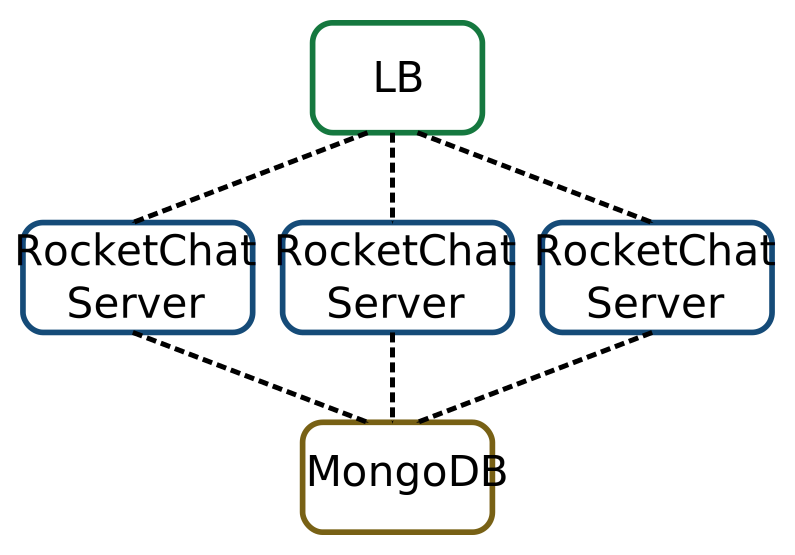
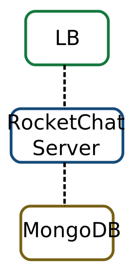

Deploy a chat service
=====================

For this workshop, you will not be guided step by step and will have to rely on
the knowledge acquired in the previous workshops.

The goal is to deploy the following architecture:

The different elements are:

* ``LB`` is a load-balancer based on nginx. There will be only one instance.

* ``RocketChat Server`` is the `RocketChat web server <https://rocket.chat/>`_
  application written in NodeJS. This is the part you will have to make
  horizontally scalable.

* ``MongoDB`` is a NoSQL database. There will be only one instance.

All the instances **MUST** be based on ``Ubuntu 18.04`` (otherwise the ansible roles will not work).

Preparation
-----------

Create and place yourself in new directory. The examples below will assume
the following structure:

.. code::

    /projects/rocket/ansible    <- contains ansible roles and playbooks
                    /terraform  <- contains the terraform configuration

Ansible configuration
^^^^^^^^^^^^^^^^^^^^^

It is recommended to use the following configuration for ansible in
``/projects/rocket/ansible/ansible.cfg``:

.. code::

    [defaults]
    inventory = inventory
    roles_path = roles
    timeout = 30

    [ssh_connection]
    control_path = %(directory)s/%%h-%%r
    pipelining = True

Using roles from ansible-galaxy
^^^^^^^^^^^^^^^^^^^^^^^^^^^^^^^

The ansible roles to deploy the software are already written and "just" need
assembling and configuration.

To use them, you will use ``ansible-galaxy`` which allows you to download and
update roles made by others.

``ansible-galaxy`` requires a ``requirements.yml`` (in ansible's directory)
which will contain the following:

.. code:: yaml

    - src: https://github.com/pgaxatte/ansible_rocket_nginx
      name: nginx
    - src: https://github.com/pgaxatte/ansible_rocket_server
      name: rocket
    - src: https://github.com/pgaxatte/ansible_rocket_mongodb
      name: mongodb

Now you can download the roles locally, into the
``/projects/rocket/ansible/roles`` directory using the following commands:

.. code:: shell

    $ cd /projects/rocket/ansible
    $ ansible-galaxy -r requirements.yml -p roles/

You should now see the new roles which where downloaded from GitHub.

.. admonition:: Task 1

    Take some time to read the roles, especially the README (easier to read
    directly from GitHub) and the ``defaults/main.yml`` files

Playbook
^^^^^^^^

The playbook will be very simple so here it is:

.. code:: yaml

    ---
    - name: Install MongoDB
      hosts: mongo_servers
      roles:
        - mongodb

    - name: Install Rocket.Chat server
      hosts: chat_servers
      roles:
        - rocket

    - name: Install load-balancer
      hosts: lb_servers
      roles:
        - nginx

.. note::

    Notice the name of the groups, you will have to generate the inventory based
    on these names.

Step 1: one instance of each
----------------------------

The goals of this first step are:

1. to deploy a simple infrastructure using terraform and with only one instance
   for each component needed by the playbook,

2. being able to output the inventory to ansible.

The workflow can be summarized by the following commands:

.. code:: shell

    $ cd /projects/rocket/terraform

    # Create magic in the form of a terraform configuration
    # [...]

    $ terraform init
    $ terraform apply

    # Magic infrastructure appears
    # [...]

    $ terraform output inventory > ../ansible/inventory/hosts

    $ cd ../ansible
    $ ansible-playbook -b playbook.yml

    # Magic software is now deployed
    # [...]

.. admonition:: Task 2

    Make the terraform magic happen

Tip: Terraform provider documentation
^^^^^^^^^^^^^^^^^^^^^^^^^^^^^^^^^^^^^^^^^^

The OpenStack provider's documentation can help you figure out the attributes
of the resources that you create and help you manipulate the output of your
configuration.

Here are some interesting parts of the documentation that you might need:

* `instances <https://registry.terraform.io/providers/terraform-provider-openstack/openstack/latest/docs/resources/compute_instance_v2#attributes-reference>`_

* `ports <https://registry.terraform.io/providers/terraform-provider-openstack/openstack/latest/docs/resources/compute_instance_v2#attributes-reference>`_

* `networks <https://registry.terraform.io/providers/terraform-provider-openstack/openstack/latest/docs/resources/networking_network_v2#attributes-reference>`_

* `subnets <https://registry.terraform.io/providers/terraform-provider-openstack/openstack/latest/docs/resources/networking_subnet_v2#attributes-reference>`_

* `security goups <https://registry.terraform.io/providers/terraform-provider-openstack/openstack/latest/docs/resources/networking_network_v2>`_

* `security rules <https://registry.terraform.io/providers/terraform-provider-openstack/openstack/latest/docs/resources/networking_network_v2>`_

Step 2: make it scale
---------------------

Now that you have a simple infrastucture up and running, make the
``chat_servers`` group scale.

This implies two things:

1. deploying multiple instances of chat servers using the ``count`` special word
   of terraform,

2. generating an inventory that can iterate through the chat servers to create
   the group.

The workflow should otherwise stay the exact same.

Tip: count and for loops
^^^^^^^^^^^^^^^^^^^^^^^^^^^^^

Here is an example of the creation of multiple resources using ``count``:

.. code:: terraform

    resource example_virtual_server web {
        # Use a variable to control the number of virtual_server resources we want
        count = var.nb_web_count

        # Include the index in the name
        name  = "web${count.index}"
        size  = "medium"
        image = "SomeLinux"

        # [...]
    }

    output example_server_web0_name {
        description = "Example output that gives the name of the first server created"
        value       = resource.example_virtual_server.web[0].name
    }

    output example_server_web_name_list {
        description = "Example output that gives an array of the names of the all the servers created"
        value       = resource.example_virtual_server.web[*].name
    }

    output example_for_loop {
        description = "Example a for loop on the servers"

        # Multi-line string using the "<<EOF" syntax
        value = <<EOF
    %{ for srv in resource.example_virtual_server.web[*] }
    ${srv.name} -> ${srv.ip_address}
    %{ endfor }
    EOF
    }

.. tip::

    If you want to get rid of the extra empty lines the for loop will generate,
    use ``~`` in the closing bracket:

    .. code::

        %{ for ... ~}
        ...
        ${ endfor ~}

.. admonition:: Task 3

    Make the terraform magic scale
